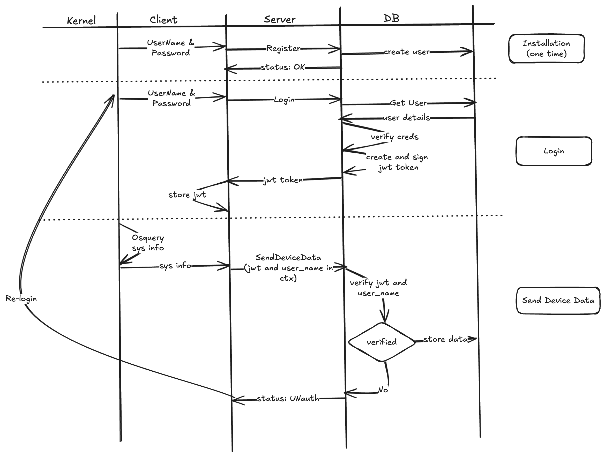

# NightsWatch
simple software to monitor system details 

# Db
contains all the operations related to database
## Conn
- Conn package establishes and maintains connection to the postgres database.
- Has a singleton class and reuses it across all the rpcs
- AutoMigrates the tables

## Model
- Defines the database schema
- Defined using gorm
- 3 tables => users,  app_data (installed apps {name, version}), os_info(os_version, osquery_version)

## Query
- Interface to abstruct db operations
- provides functionalities of creating user, updating login time, adding data to different tables such as os_info and apps_data, and fetching latest data for a user
- for adding device data(app_data & os_info), as the underlying tables are different, used transaction.

# JWTS
## internal package => secrets
- read secret to sign the jwt
- in actual prod, it will read from a secure bucket

## jwts
- creates and signs a token
- verifies a token, and fetches user name out of it

# Server
- implements the rpcs mentioned in the proto, i.e, Register, Login, SendDeviceData, GetLatestData
- Register, as it says, registers a new user
- Loging, returns a singed jwt token to the user
- SendDeviceData adds latest system info of a user to the db. It is authenticated using the jwt token signed during login.
- GetLatestData fetches the latest system info in db for a user.
- every rpc validates the request
- for SendDeviceData, we validate the request, as well as get the token from the context and extract the user_name from it. Then match with the user_name present in the metdata. This provides authentication.

# Validate
- simple validation of the rpc requests

# Flow

